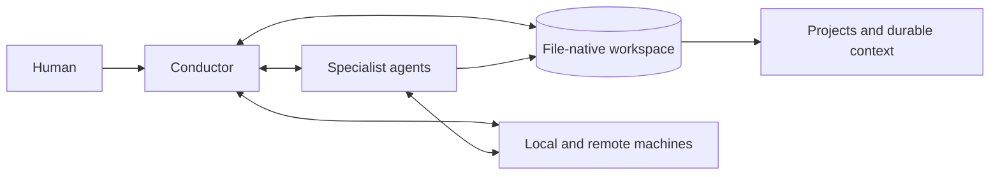

<p align="center">
  
</p>

# Cortex

**A file-native operating environment for long-running human-agent work.**

Cortex gives you one conductor chat for coordinating projects, durable context,
specialist agents, and real machines across sessions. Its source of truth is a
workspace of transparent files that you own: tasks, logbooks, instructions,
inboxes, project notes, and operational state.

[Quickstart](#quickstart) · [How it works](#how-cortex-works) ·
[Who it is for](#who-cortex-is-for) · [Examples](#example-workflows)

## Give long-running work a durable home.

Research and engineering work may last for months, but AI conversations are
episodic. Decisions become scattered across chats, experiments outlive their
original context, agents repeat old work, and important knowledge disappears
into raw conversation history.

Cortex externalizes that context into structured work state that agents can
selectively reload. You use the conductor like a normal chat: ask a question,
discuss an idea, or request work in natural language. The conductor keeps the
relevant project files, tasks, results, and durable memories organized and can
delegate bounded work when another agent is useful.

Agent SDKs help developers build agent applications. Cortex instead helps a
person organize and operate their own ongoing work with agents.

## Why Cortex

- **Project-centered continuity:** the durable object is the project, not just
  an agent or conversation. Decisions, tasks, experiments, references, and
  results survive individual chats.
- **One human-facing conductor:** you do not need to design an agent graph before
  Cortex becomes useful. Start with one chat and add specialist agents only
  when the work benefits from them.
- **Files as the source of truth:** normal text files keep the system
  inspectable, versionable, scriptable, backup-friendly, and portable.
- **Clear context boundaries:** framework, user, environment, and project facts
  have separate homes. Personalization stays private while reusable framework
  code can remain public.
- **Operational reach:** workers and nodes can handle bounded implementation,
  research, monitoring, messaging, backup, and multi-machine work.
- **Natural-language adaptation:** tell the conductor about a recurring
  preference, missing rule, or workflow improvement and it can record that
  lesson in the durable surface that owns it.
- **Provider flexibility:** Cortex uses capable provider CLIs and their native
  sessions. Most of the workspace model is independent of any one LLM vendor.

## How Cortex Works



The conductor is the main entry point. For a typical request it:

1. identifies the relevant project, user preferences, and environment facts
2. inspects existing tasks, decisions, and artifacts instead of starting from
   an empty conversation
3. answers directly or delegates a bounded task to an appropriate agent
4. verifies the outcome and records only the information that should survive
5. returns a concise result to the user

Cortex remains useful with only the conductor. A larger fleet is optional:
read-only nodes can inspect or compute, workers can perform scoped changes, and
the watch agent can monitor unattended work or messaging channels.

The workspace separates four kinds of context:

- **Framework:** reusable scripts, role definitions, defaults, and docs
- **User:** preferences, reminders, and provider usage information
- **Environment:** hostnames, paths, remotes, backup roots, and infrastructure
- **Project:** tasks, logbooks, references, rules, experiments, and results

This separation is what lets a live private checkout evolve without leaking
deployment details into a public framework release.

Multiple conductor windows can be open at once. Each has session-local runtime
metadata under `agents/conductor/sessions/`, while all windows share the same
project state and conductor inbox. Only one window should perform inbox triage
or agent dispatch at a time.

## Who Cortex Is For

Cortex is designed for technical individuals and small research or engineering
groups whose work spans projects, sessions, experiments, or machines. It is a
particularly good fit when you want agents to participate in real work while
leaving an understandable, durable record behind.

Cortex is deliberately a single-operator framework, not a multi-user system:
the `users/` folder keeps private preferences and reminders cleanly separated,
rather than providing accounts or shared-user coordination. It is probably not
the right layer if your primary goal is to build a customer-facing agent
application, define a production workflow graph, obtain an enterprise hosted
control plane, or use a turnkey chat assistant without maintaining a local
workspace.

## Quickstart

### Requirements

Minimum:

- Linux or macOS
- `bash`
- `git`
- Python 3
- one provider CLI that Cortex can launch, usually `claude` or `codex`

Commonly useful:

- `screen` for long-lived agents
- `ssh` for remote node setups
- optional Signal / Telegram tooling if you want messaging ingress

### Recommended first run

Clone the repo, then start the conductor:

```bash
git clone <repo-url> cortex
cd cortex
bash cortex.sh
```

On its first start, Cortex creates the local surfaces a real checkout needs,
including:

- `user.instruct` and `environment.instruct`
- `users/<user>/...`
- `environments/<env>/...`
- `agents/conductor/...`
- inbox, broadcast, and log directories

It does **not** require you to configure every optional subsystem up front.
A fresh clone can start cleanly without Signal, Telegram, watch, backup, or
public-sync setup.

On the first chat, Cortex asks about the first project before optional setup.
It asks follow-up questions only for capabilities you want to enable: shared
multi-machine operation, backups, Signal/Telegram, public export, or standing
workers. The private `environments/<env>/settings.env` file is the durable
home for optional runtime choices such as conductor/agent provider defaults,
backup retention, relay hosts, and a public export remote. Keep credentials in
`agents/conductor/secrets/`, never in that settings file.

Safe defaults are disclosed during that chat: nothing unattended starts by
itself; the conductor defaults to Codex and general agents to Claude unless
configured otherwise; provider permission behavior remains unchanged unless
overridden; and the initial backup manifest covers only the Cortex worktree.
Public release is always a sanitized export via `scripts/sync_public.sh`, never
a push of the live operational branch.

If required local state is missing and you are in an interactive shell,
`bash cortex.sh` will offer the same bootstrap flow automatically. Use
`--no-init` if you want to suppress that behavior.

Until the checkout has at least one project under `projects/`, the conductor
also follows `setup.instruct` on startup to guide the first-project setup.

You can begin with ordinary requests such as:

> Create a project for my new experiment and help me turn the idea into a plan.

> What did we conclude the last time we worked on this project?

> Inspect the current implementation, make the change, run the relevant tests,
> and record the durable outcome.

For a multi-machine setup, a shared NAS-mounted checkout can be linked at the
same path on each host. Environment-specific hostnames, paths, and credentials
belong in the private environment layer, not in framework files.

## Provider and Session Options

By default, `cortex.sh` starts a fresh conductor session with Codex. You can
override that explicitly:

```bash
bash cortex.sh --provider codex
bash cortex.sh --provider claude
bash cortex.sh --label paper
```

To pick a specific model, pass `--model` with a short version alias. The
accepted aliases are:

- `--provider claude --model fable-5` → Claude Fable 5 (`claude-fable-5`)
- `--provider claude --model sonnet-5` → Claude Sonnet 5 (`claude-sonnet-5`)
- `--provider claude --model 4.8` → Claude Opus 4.8 (`claude-opus-4-8`)
- `--provider claude --model 4.7` → Claude Opus 4.7 (`claude-opus-4-7`)
- `--provider claude --model 4.6` → Claude Sonnet 4.6 (`claude-sonnet-4-6`)
- `--provider codex  --model 5.6` → GPT-5.6 Sol through the `gpt-5.6` alias
- `--provider codex  --model 5.6-sol` → GPT-5.6 Sol (`gpt-5.6-sol`)
- `--provider codex  --model 5.6-terra` → GPT-5.6 Terra (`gpt-5.6-terra`)
- `--provider codex  --model 5.6-luna` → GPT-5.6 Luna (`gpt-5.6-luna`)
- `--provider codex  --model 5.5` → Codex `gpt-5.5`
- `--provider codex  --model 5.4` → Codex `gpt-5.4`

Anything else is rejected with the accepted-alias list. Omit `--model` to fall
back to the provider's own default.

To resume the most recent conductor chat with its existing model/context, use:

```bash
bash cortex.sh --resume
```

`--resume` reuses the last conductor provider and its native session history.
If you pass `--provider` together with `--resume`, Cortex warns and ignores
`--provider` so it can resume the correct provider session cleanly. `--model`
can be combined with `--resume` to switch the model on the resumed session.

For explicit interactive conductor permission settings, use:

```bash
bash cortex.sh --provider codex --permission default
bash cortex.sh --provider codex --permission auto-review
bash cortex.sh --provider codex --permission full-access
bash cortex.sh --permission-all
```

Codex supports the same user-facing permission presets as its permissions
menu: `default` uses workspace-write with ordinary user approvals,
`auto-review` uses the same workspace-write scope while routing eligible
on-request approvals through the auto-reviewer subagent, and `full-access`
adds `--dangerously-bypass-approvals-and-sandbox`. Claude support is
deliberately limited to verified modes: `default` and `full-access`, where
`full-access` adds `--dangerously-skip-permissions`. `--permission-all` is a
global shorthand for `--permission full-access`; `--permission-default`
remains a compatibility shorthand. `CORTEX_CONDUCTOR_PERMISSION_MODE` sets
the permission preset default. If no permission flag or environment default
is provided, Cortex leaves the provider's existing permission configuration
unchanged. Cortex role, user, project, and environment safety rules still apply.

If the chosen provider CLI is not installed, Cortex fails early with a plain
setup error.

Most of Cortex is deliberately independent of the LLM provider. Provider-specific
dependencies are mainly in the edges where the framework has to talk to a
provider's native session/runtime format, such as token-cost accounting,
conductor chat transcript capture, and provider-specific launch/resume glue.
The conductor should also be able to onboard a new provider when asked by
patching those boundaries rather than treating Cortex as tied to one vendor.

If another conductor window is already active, `cortex.sh` warns at startup and
prints an exhaustive color-coded agent roster before the operator snapshot;
the operator snapshot also shows the active session count. The top-level
`agents/conductor/{info,status,heartbeat}` files are now aggregate views derived
from the live per-session runtime files.

## Operator Commands

Start the conductor:

```bash
bash cortex.sh
bash cortex.sh --resume
bash cortex.sh --permission-all
```

Other agents should usually be started by the conductor agent. For manual/custom runs:

Start a node agent on the current machine:

```bash
bash scripts/start_agent_screen.sh --role node --provider codex
```

Node agents on several servers can share one Cortex checkout. On every node
host, create a symlink to the same central Cortex directory (for example, on
shared storage reachable from every server) so the agents use one shared
control plane. The conductor must be able to SSH to each node host; keep the
actual host and access details in `environments/{env}/cheat_sheet.md`.

Start a named worker:

```bash
bash scripts/start_agent_screen.sh --role worker --name commit --provider codex
WORKER_REVIEW_INTERVAL=<seconds> bash scripts/start_agent_screen.sh --role worker --name cleanup --wake-seconds "${WORKER_REVIEW_INTERVAL}"
```

If a worker should fall back to another provider after quota/auth failures,
launch it with `FALLBACK_PROVIDER=claude` (or `codex`) and optionally
`PROVIDER_FAILURE_COOLDOWN_SECONDS=<seconds>`.

The screen helper is idempotent: if the matching screen already exists, it
prints the current status/heartbeat age instead of starting a duplicate.
Routine startup registration is local-only by default; set
`AGENT_REGISTER_NOTIFY=1` when a launch should explicitly notify the
conductor inbox.

Start the watch agent:

```bash
bash scripts/start_agent_screen.sh --role watch --wake-seconds "${CORTEX_DEFAULT_WATCH_INTERVAL_SECONDS}"
```

`--wake-seconds N` is role-aware in the screen helper: for `worker` it sets the
periodic worker-check cadence via `WORKER_REVIEW_INTERVAL`, and for `watch`
it maps to the watch interval (`CORTEX_DEFAULT_WATCH_INTERVAL_SECONDS` in
`config/cortex_defaults.sh`). It is rejected for `node` starts.

For long-lived agents, run them in `screen` and keep output visible inside the
session. The framework rules assume you can reconnect and inspect live output.

Run framework validators:

```bash
bash scripts/cortex_doctor.sh
bash scripts/cortex_doctor.sh --check tasks
```

`cortex_doctor.sh` is a deterministic drift check for task-board layout,
metadata-driven worker docs/ownership, public/private sync boundaries, sandbox
exposure, commit-worker git guardrails, and local repository hygiene. It exits
non-zero when a check needs operator attention, so it is suitable before
framework commits or public-sync work.

## Example Workflows

### Research

Give Cortex a hypothesis or ask it to investigate one. It can inspect prior
project results, turn the idea into an experiment, delegate literature or
implementation work, and monitor the run. Cortex keeps the relevant tasks,
results, and conclusions organized automatically, so the next conversation can
continue from the project record instead of reconstructing the research history
from chat.

### Engineering

Ask the conductor to diagnose a bug or implement a feature. It can inspect the
project rules, assign a bounded change to a worker, run the relevant checks,
and leave the code, task state, and durable rationale aligned.

### Long-running operations

Use nodes and workers to inspect several machines, launch or monitor long jobs,
and use watch to keep an eye on experiments and support messenger communication
while you are away.

The exact actions available in each workflow depend on the permissions and
filesystem or host access granted to the active agents.

## Agent Types

### Conductor

The conductor is the human-facing control plane.

- launched with `bash cortex.sh`
- owns cross-project operational bookkeeping
- reads context and updates durable memory
- sends bounded work to other agents
- receives and summarizes their responses

If you use only one Cortex role, this is the one.

### Node

Nodes are the lightweight read/compute agents.

- started directly with `bash scripts/start_agent.sh`, or in a managed
screen with `bash scripts/start_agent_screen.sh --role node`
- usually one per machine, though you can run more via `--name`
- good for inspection, status checks, analysis, and bounded compute tasks
- not meant to perform freeform write-capable host operations

For a single-machine setup, you may not need dedicated nodes at all. They
become more useful once you spread work across several servers.

### Worker

Workers are elevated task-execution agents.

- started directly with `bash scripts/start_agent.sh --role worker --name <id>`,
or in a managed screen with `bash scripts/start_agent_screen.sh --role worker --name <id>`
- can be one-shot (`--once`) or persistent
- use the same inbox/response model as nodes
- are intended for bounded write-capable or operations-capable work

Workers are where Cortex becomes a real multi-agent system rather than a
single chat with helper scripts.

### Watch

The watch agent is the unattended monitoring role.

- started directly with `bash scripts/start_agent.sh --role watch`, or in a
managed screen with `bash scripts/start_agent_screen.sh --role watch`
- runs on an interval loop
- can monitor state, wake on inbox activity, and send notifications
- is useful when Cortex should keep an eye on things while you are away

Watch is optional. A lot of Cortex use is perfectly fine with only the
conductor plus a few workers.

## Worker Role Reference

Cortex supports plain generic workers, but the framework also ships with
specialized named worker roles. This catalog is reference material rather than
a recommended default fleet. The roles are defined by
`roles/<category>/worker.<name>.instruct` plus
`roles/<category>/worker.<name>.meta`.

<!-- BEGIN GENERATED: worker-role-catalog -->
### Operational workers

These are the workers that keep the system tidy and durable over time.

| Worker | Lifecycle | Default cadence | Writes | Domain |
| --- | --- | --- | --- | --- |
| `backup` | persistent | daily | yes | snapshot creation from backup_targets.txt; backup-freshness tracking |
| `cleanup` | persistent | daily | yes | inbox, archive, and temp-file housekeeping across agent directories |
| `commit` | persistent | every 12h | yes | git staging/commit/push for runtime dirt within the strict allow-list; never active source/policy without explicit COMMAND |
| `compressor` | persistent | every 12h | yes | logbook/task-board/archive size management via rotate/zip helpers; never rewrites live content |

### Framework review workers

These workers are analysis-first by default: they inspect one framework/runtime slice, report findings, and repair only on explicit COMMAND. They audit and improve Cortex itself by turning otherwise stochastic agent behavior into inspectable evidence, durable findings, and explicit follow-up rules or repairs. They cannot make an LLM deterministic, but they make the surrounding framework as repeatable and accountable as practical.

| Worker | Lifecycle | Default cadence | Writes | Domain |
| --- | --- | --- | --- | --- |
| `calibration` | persistent | daily | no | per-agent behavior-vs-instruction drift; proposes targeted instruction edits |
| `consistency` | persistent | daily | no | ownership-boundary drift: project facts in wrong files, duplicated rules across layers |
| `efficiency` | persistent | every 6h | no | workflow inefficiencies: repeated conductor work, avoidable token burn, missing shortcuts |
| `environment` | persistent | daily | no | infrastructure ground-truth drift: cheat sheet vs ssh config; host/GPU/NAS/IP probes |
| `memory` | persistent | daily | no | hygiene of durable memory surfaces: stale/duplicate rows, orphaned logbook entries |
| `metacortex` | persistent | daily | no | philosophical self-reflection over Cortex as a whole; writes its treatise to own notes.txt on 24h cadence |
| `privacy` | persistent | daily | no | framework privacy boundary: concrete user/project/deployment details leaking into generic framework surfaces |
| `reliability` | persistent | daily | no | runtime health: stuck loops, stale heartbeats, failed periodics, missing recovery recipes |
| `security` | persistent | daily | no | security and sandbox posture: credential exposure, broad binds, permission drift |
| `simplify` | persistent | daily | no | deletion-biased review of code/spec/worker growth; every ticket proposes removal/consolidation (never addition) |

### Closed-loop implementation workers

Use these when you want a bounded review/repair loop without the conductor hand-authoring every round.

| Worker | Lifecycle | Default cadence | Writes | Domain |
| --- | --- | --- | --- | --- |
| `student` | on-demand | manual only | yes | loop experiment: implements rounds issued by the supervisor worker |
| `supervisor` | on-demand | short | yes | loop experiment: iterative review/repair loop driving the student worker |

### Research workers

These are mission-scoped specialist roles for the current research cycle; launch only the specialists that match the active mission.

| Worker | Lifecycle | Default cadence | Writes | Domain |
| --- | --- | --- | --- | --- |
| `research-analyst` | persistent / specialist | manual only | yes | research specialist: turning experiment artifacts into evidence |
| `research-critic` | persistent / specialist | manual only | yes | research specialist: falsification and validity checks |
| `research-designer` | persistent / specialist | manual only | yes | research specialist: turning hypotheses into concrete experiments |
| `research-engineer` | persistent / specialist | manual only | yes | research specialist: bounded implementation work for deep-learning experiments |
| `research-lead` | research-cycle / lead | hourly | yes | coordinator for the deep-learning research cluster; hypothesis synthesis |
| `research-literature` | persistent / specialist | manual only | yes | research specialist: scientific context and prior-work grounding |
| `research-runner` | persistent / specialist | manual only | yes | research specialist: launching and monitoring deep-learning experiments |
| `research-scribe` | persistent / specialist | manual only | yes | research specialist: maintaining project-local research notes |
| `research-theorist` | persistent / specialist | manual only | yes | research specialist: mechanisms, hypotheses, and expected outcomes |

### Experiment workers

These workers own autonomous, mission-scoped experiment improvement loops with local notes, cheatsheets, and launch recipes.

| Worker | Lifecycle | Default cadence | Writes | Domain |
| --- | --- | --- | --- | --- |
| `sweep` | persistent | hourly | yes | autonomous deep-learning experiment sweeper: monitors, analyzes, launches, and iterates within its mission |
<!-- END GENERATED: worker-role-catalog -->

### Research as an extension pattern

The research fleet is the clearest example of how Cortex is meant to be
*extended* rather than just configured. Cortex does not treat "research" as a
hard-wired capability: the whole cluster is a self-contained bundle of role
instructions, metadata, and helpers under `roles/research/`, added the same way
you would add your own specialized fleet for a different domain. If you want to
grow Cortex for new kinds of work, this bundle is the worked example to copy —
see `roles/agent_building.md` for the bundle/layout spec that any new agent
fleet should follow, and `roles/research.instruct` for this cluster's codified
workflow.

You do not need every research specialist on every mission. Launch only the
workers that match the active cycle.

## Important Directories

You do not need the full tree memorized. The main surfaces are:

- `cortex.sh`: chat entry point for the conductor
- `scripts/`: runtime and helper scripts
- `roles/`: agent instructions and named worker role definitions
- `users/`: user-specific durable state, including `users/<user>/usage/usage.tsv`
  and user preferences/reminders
- `agents/conductor/sessions/`: per-window conductor runtime state, including
  optional session-local transcript logs such as
  `agents/conductor/sessions/<session>/prompt_log.txt`
- `environments/`: deployment-specific settings and infrastructure facts
- `projects/`: project homes
- `agents/`: live agent homes, inboxes, logs, and local runtime memory
- `broadcast/`: shared outbound messages from the conductor

If you are new to the framework, focus first on `cortex.sh`, `roles/`,
`projects/`, and the `agents/conductor/` home.

## Safety and Ownership

Cortex makes agent work inspectable, but inspectability is not isolation.
Agents launched with elevated permissions can modify or delete any data their
runtime is allowed to reach. Start with the narrowest useful role and access
level, keep important work versioned or backed up, and review environment and
permission settings before enabling unattended operation.

The framework distinguishes read-oriented nodes, write-capable workers, and
role-specific rules so authority can be bounded. Destructive actions still
require explicit care; installing Cortex does not make an otherwise unsafe
host or agent tool safe automatically.

## Local vs Public State

Cortex is designed so a live working checkout can stay private while the
framework itself can be published.

In practice:

- framework files should stay generic and reusable
- live `users/`, `environments/`, `projects/`, agent state, inboxes, and logs
are operational/private by default
- public publication should go through `scripts/sync_public.sh`, which builds a
fresh sanitized export instead of pushing the live operational branch

If you are adapting Cortex for your own work, keep private facts in the user or
environment layer rather than baking them into framework docs or scripts.
Deployment-specific public-sync leak patterns can live in
`config/public_forbidden_patterns.local`,
`environments/<env>/public_forbidden_patterns.txt`, or
`agents/conductor/secrets/public_forbidden_patterns.txt`; those paths are not
part of the public export manifest.

## License

Released under the [MIT License](LICENSE).

## When To Add More Agents

Start small.

A good progression is:

1. conductor only
2. conductor + one or two workers you actually need (good candidates for

everyday use are the "operational workers" above)
3. add watch if unattended monitoring becomes useful
4. add remote nodes or research specialists when the workload genuinely wants
  parallelism

Do not launch a full fleet just because the roles exist. Cortex is more useful
when the running agents reflect the real workload.

## Where To Read Next

- [PROTOCOL.md](PROTOCOL.md): wire-level contract, message envelopes, and agent
  lifecycle
- [roles/conductor.instruct](roles/conductor.instruct): how the conductor is
  supposed to behave
- [roles/worker.instruct](roles/worker.instruct): generic worker rules
- [roles/watch.instruct](roles/watch.instruct): watch-agent behavior
- [BASH_RECIPES.md](BASH_RECIPES.md): reusable operator snippets
- [SHORTCUTS.md](SHORTCUTS.md): framework-level task recipes

If you want to understand the system quickly, read this README first, then
`PROTOCOL.md`, then the role file for the agent you actually plan to run.
